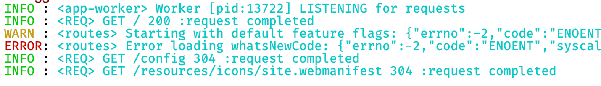
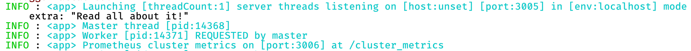

# Logging in Framework-based applications

Framework creates PML-standard Pino-based JSON logs that can be easily consumed and queried against using AWS CloudWatch Insights.

A more complete README can be found in the [PML-Trace-Logging repo](https://bitbucket.pennmutual.com/projects/WEB/repos/pml-trace-logging/browse).  More detailed information can be found in the [PinoJS repo](https://github.com/pinojs/pino).

As currently implemented in PML-Trace-Logging, the Pino logger will create pure JSON logs when running in environments that start with `production`, `model`, or `development`.  Otherwise it will run in "pretty print" mode, which is easier for humans to read.

The JSON logs look like the following:

    {"logLevel":"info","timestamp":"2020-07-31T18:49:23.063Z","hostProcess":13745,"hostName":"MORYL2MAC-HO.local","logType":"service","hostAddress":"192.168.0.138","module":"app-worker","logMessage":"Worker [pid:13745] LISTENING for requests"}
    {"logLevel":"info","timestamp":"2020-07-31T18:49:28.821Z","hostProcess":13745,"hostName":"MORYL2MAC-HO.local","logType":"access","hostAddress":"192.168.0.138","module":"REQ","request":{"method":"GET","path":"/"},"traceHeaders":{"Chain-Host-Address":"127.0.0.1,192.168.0.138","Chain-Host-Name":"MORYL2MAC-HO.local","Request-Trace-ID":"bbf19b46-8e8f-45a0-999d-06362b8b41f4","Session-Trace-ID":"631843b7-67f7-4cf1-9f67-c79c390e0c04","User-Address":"127.0.0.1","User-Context":"CORPORATE","User-ID":"moryl"},"response":{"statusCode":200},"elapsedTime":26,"logMessage":"request completed"}
    {"logLevel":"warn","timestamp":"2020-07-31T18:49:28.994Z","hostProcess":13745,"hostName":"MORYL2MAC-HO.local","logType":"service","hostAddress":"192.168.0.138","module":"routes","logMessage":"Starting with default feature flags: {\"errno\":-2,\"code\":\"ENOENT\",\"syscall\":\"open\",\"path\":\"../../insight-whats-new/config-localhost/feature-flags.json\"}"}
    {"logLevel":"error","timestamp":"2020-07-31T18:49:28.995Z","hostProcess":13745,"hostName":"MORYL2MAC-HO.local","logType":"service","hostAddress":"192.168.0.138","module":"routes","logMessage":"Error loading whatsNewCode: {\"errno\":-2,\"code\":\"ENOENT\",\"syscall\":\"open\",\"path\":\"../../insight-whats-new/change-log-indicator.txt\"}"}
    {"logLevel":"info","timestamp":"2020-07-31T18:49:28.997Z","hostProcess":13745,"hostName":"MORYL2MAC-HO.local","logType":"access","hostAddress":"192.168.0.138","module":"REQ","request":{"method":"GET","path":"/config"},"traceHeaders":{"Chain-Host-Address":"127.0.0.1,192.168.0.138","Chain-Host-Name":"MORYL2MAC-HO.local","Request-Trace-ID":"24758d63-619d-448e-99db-d71a556192dd","Session-Trace-ID":"631843b7-67f7-4cf1-9f67-c79c390e0c04","User-Address":"127.0.0.1","User-Context":"CORPORATE","User-ID":"moryl"},"response":{"statusCode":304},"elapsedTime":7,"logMessage":"request completed"}
    {"logLevel":"info","timestamp":"2020-07-31T18:49:29.200Z","hostProcess":13745,"hostName":"MORYL2MAC-HO.local","logType":"access","hostAddress":"192.168.0.138","module":"REQ","request":{"method":"GET","path":"/resources/icons/site.webmanifest"},"traceHeaders":{"Chain-Host-Address":"127.0.0.1,192.168.0.138","Chain-Host-Name":"MORYL2MAC-HO.local","Request-Trace-ID":"3e2a0bd4-3f9f-4dd8-90b3-518148d7004e","Session-Trace-ID":"b95ea86f-d423-4053-9914-f1a63dd27475","User-Address":"127.0.0.1"},"response":{"statusCode":304},"elapsedTime":3,"logMessage":"request completed"}

The pretty printed JSON logs look like this:

The first column in the pretty version is the normal log level.  The portion inside the angle brackets (`<REQ>`, `<app-worker>`, and `<routes>`), is the module that created the logs.  The module can be set when the logger is imported into a JavaScript file.  If not, it will use a default value.  All access log requests get a module name of `REQ` to make them easy to filter on/out.

## The Default Logger Object

Just as Node.js's `console` object is available globally for use, so is this our `logger` object, provided you have included the initialization code in your main file.  The initialization code looks like this:

    require('pml-trace-logging')({ // this should be called in the main application start file, before any other references
      doPretty: true, // whether or not to use non-JSON pretty printing
      ignoreList: 'time,hostAddress,hostProcess,hostName,logType,elapsedTime,request,response,module', // parameters to ignore during pretty-print mode
      excludePattern: /\/about|\/heartbeat|\.(?:html|js|css|png|gif|jpg|woff|ttf)/, // request URL patterns to ignore
    })

Given the above code in your start file, you can then do things like this from any file in your application:

    logger.error('Danger, Will Robinson!')

Note that unlike Node's default `console` object, you cannot simply concatenate parameters onto a string to see them.  For example, the following will not work as expected:

    let name = 'Michael'
    logger.info('My name is', name) // will only display "My name is"

In order to get the desired effect, you need to use one of the following:

    logger.info(`My name is ${name}`) // "My name is Michael"
    logger.info('My name is %s', name) // "My name is Michael"

The available formatting parameter placeholders are:

- `%s` for strings
- `%d` for numbers (digits)
- `%j` or `%o` for JSON or objects

The following levels can be used on the logger object for logging messages:

- `info`
- `warn`
- `error`
- `debug`
- `trace`
- `fatal`

## Defining Application "Modules" for Logging

Modules can be defined, if desired, when the logger is imported from `pml-request-trace-logging`.

You do that by importing a `childLogger` of the logger exported from the main module.

    const logger = require('pml-trace-logging').consoleLogger.child({module: 'some-name'})

Anything logged with the above imported logger would have a property called `module` with a value of `some-name`.  It would show in pretty print formatted logs as `<some-name>` after the log level, but before any actual log message - just as you saw `<app-worker>` and `<routes>` below:

If the default logger is used, or if not module property is configured, then `<>` will be used instead of a user-specified module name.

Note that it can be very useful to use the following for importing a child-logger into each file:

    const logger = require('pml-trace-logging').consoleLogger.child({module: require('path').basename(__filename)})

This will always cause the module to be the name of the current source file, such as `<app-worker.js>` or `<routes.js>`.

## Including Properties in Pretty Logs

By default, most of the properties in the JSON logs do NOT make it into the pretty print version.  There's just too much data.  By default, the system is configured to ignore the following log properties:

    time,hostAddress,hostProcess,hostName,logType,elapsedTime,request,response,module,traceHeaders
    
Note that there are no spaces in the above property list.

It is sometimes useful to include some of those default excluded properties temporarily.  As such, the system will look for an environment variable called `PINO_PRETTY_PRINT_IGNORE` and will ignore only the specified properties.  So, for example, you could remove `traceHeaders` from the ignore list by removing it from the list above and setting that value in the environment.

    PINO_PRETTY_PRINT_IGNORE=time,hostAddress,hostProcess,hostName,logType,elapsedTime,request,response,module
    
If you were to restart the server, you would get logs that include the `traceHeaders` property (and sub-properties), like in the following example:

If you were to set the environment to " " (a blank space), you would then get EVERY property in the logs shown, though formatted in a way more readable than the default non-pretty logs.

## Printing Formatted Strings to the Logger

The default Pino logger object accepts `sprintf` style formatted strings and expects any following parameters to correspond to embedded formatting placeholders.  For example:

    logger.info('Hi, my name is %s and I am %d years old: %j', 'Bob', 12, {some: 'value'})
    
That would log a string looking like `Hi, my name is Bob and I'm 12 years old: {some: "value"}`.

`%s` expects a string, `%d` expects a number, and `%j` expects an object.

You can NOT just concatinated strings by adding them as extra parameters, though.  The following example will not work the same as a `console.info()` call in Node.js would.

    let name = 'Bob'
    logger.info('My name is', name)
    
That would log only `My name is` and would ignore the extra param since there was no formatting placeholder for it.

Instead you would want to use

    logger.info('My name is %s', name)
    
Or, preferably:

    logger.info(`My name is ${name}`)
    
## Adding Additional JSON Data to Logs

A Pino logger instance can accept an object as its first parameter, and that object will override any matching existing properties in the log object, or add any non-matching parameters.  For example:

    logger.warn({extraData: 'Goes here!'}, 'This is the logMessage')
    
The above would add a top level property called `extraData` with a value of `Goes here!` to the logged JSON object.

As a result, the following line would show extra data - even when pretty printed - because of the object passed as the first param:

      logger.info({extra: 'Read all about it!'}, 'Launching [threadCount:%d] server threads listening on [host:%s] [port:%d] in [env:%s] mode', config.server.numberOfThreads, process.env.HOSTNAME || 'unset', config.port, process.env.NODE_ENV)

